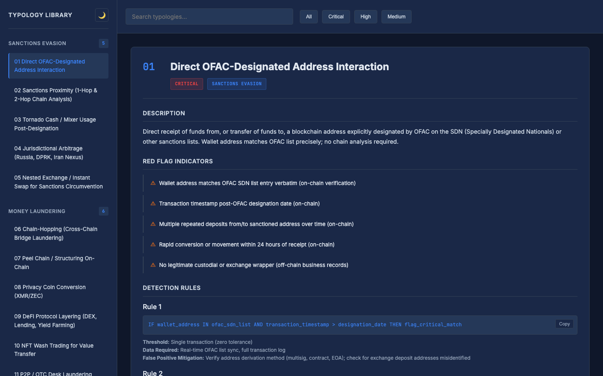

# Claude Agent Fleet

[](https://github.com/maxmoran23/Claude-Agent-Fleet/actions/workflows/ci.yml)
[](https://www.python.org/)
[](LICENSE)

**A production-grade framework for building, scheduling, and operating autonomous agent fleets on Claude. Self-repairing, self-budgeting, with runnable Python reference implementations.**

---

## What This Is

A reference architecture for operating multiple autonomous agents as a cohesive intelligence system — covering real-time monitoring, scheduled analysis, workflow automation, and operational self-maintenance. Designed around the idea that a structured natural language prompt executed on a schedule, with persistent memory and self-observability, is a production-viable software component.

Every agent is a structured natural language prompt executed on a schedule. Agents gather live data from external sources, maintain persistent memory across runs via Slack Canvases and a SQLite data layer, rate their own output quality, and — when something breaks — repair themselves without human intervention. A JIT budget manager monitors fleet-wide token consumption and autonomously throttles agent frequencies as resource limits approach, preserving output quality by reducing run count rather than degrading the model or prompt depth.

This repository documents the architecture, design decisions, and operational patterns. It also includes runnable Python reference agents wired to GitHub Actions so the scheduling and observability story is demonstrated end-to-end — not just described. Fifteen additional agent specs are included in `examples/` as prompt-only references, and companion analytical dashboards in [`showcase/`](showcase/) illustrate the visual half of the output stack.

---

## Running the Reference Agents

Five agents ship as runnable Python modules backed by the Anthropic Messages API, with GitHub Actions workflows for scheduled execution.

| Agent | Schedule | Output |
|-------|----------|--------|
| [`research_digest`](agents/research_digest/) | Daily 11:00 UTC | Synthesis of noteworthy AI/ML developments |
| [`market_monitor`](agents/market_monitor/) | Every 8h | Crypto market snapshot + narrative |
| [`regulatory_oracle`](agents/regulatory_oracle/) | Daily 12:00 UTC | Digital-asset and AML/CFT regulatory briefing |
| [`fleet_watchdog`](agents/fleet_watchdog/) | Every 6h | Fleet health report from GitHub Actions run history |
| [`synthesis_engine`](agents/synthesis_engine/) | Daily 01:00 UTC | Meta-analysis across sibling agents' runs — themes, contradictions, gaps |

### Local

```bash
pip install -r requirements.txt
cp .env.example .env  # fill in ANTHROPIC_API_KEY, SLACK_BOT_TOKEN, SLACK_DEFAULT_CHANNEL
PYTHONPATH=. python agents/research_digest/agent.py
```

### CI

Set these as [repository secrets](https://docs.github.com/en/actions/security-guides/using-secrets-in-github-actions):

- `ANTHROPIC_API_KEY`
- `SLACK_BOT_TOKEN`
- `SLACK_DEFAULT_CHANNEL`

The workflows under `.github/workflows/` will then run on their cron schedules. `ci.yml` runs the test suite on every push.

### Tests

```bash
pip install -e ".[dev]"
pytest
```

---

## Why This Matters

Most approaches to "agent systems" fall into one of two failure modes:

1. **Monolithic prompts** — a single agent with a giant prompt trying to do everything. Brittle, unobservable, hard to evolve.
2. **Orchestration-heavy frameworks** — tightly coupled pipelines with complex state machines. High cognitive overhead for operators; cascading failures when any link breaks.

This framework takes a different path: **loosely coupled agents that communicate through shared state, each following a common production pattern, collectively forming a self-observing and self-repairing system**. The outcome is a fleet that can scale from 3 agents to 50+ without the operator rebuilding the orchestration every time, that fails gracefully rather than catastrophically, and that produces an audit trail of its own evolution.

The patterns here emerged from building and operating such a system in production — refined through cycles of iteration under real resource constraints and real operator attention budgets. Everything in this repository is battle-tested architecture, generalized for reuse.

---

## Who This Is For

- **Builders** designing their own agent fleets and looking for architectural patterns that have survived production pressure
- **Engineers** evaluating how autonomous agent systems can be structured, observed, and maintained at scale
- **Compliance and fintech practitioners** specifically — the examples skew toward regulatory, on-chain, and market-intelligence use cases because that's where the patterns were battle-tested
- **Claude Code users** looking for reference implementations beyond single-agent examples
- **AI infrastructure engineers** thinking about cost management, observability, and fault isolation in agent systems

If you're building a fleet of 3+ agents that need to run autonomously on a schedule and produce reliable output, this framework maps directly to your problem. If you're building a single agent or a one-shot tool, this is probably more framework than you need.

---

## What It Does

The framework is built to operate an agent fleet across any domain. Illustrative use cases where this architecture has been applied:

| Domain | Example Agents | Function |
|--------|---------------|----------|
| **Crypto Markets** | Price monitor, macro sentiment, on-chain analytics, virtual portfolio manager, token discovery | Real-time data feeds synthesized into narrative intelligence |
| **Regulatory / AML** | Enforcement tracker, legislation watch, sanctions screening, deadline alerts | Compliance landscape monitoring with structured severity scoring |
| **Research** | Paper translation, cross-domain synthesis, topic discovery | Signal extraction from high-volume research streams |
| **Workflow** | Meeting prep, email triage, channel summarization, interactive Q&A | Active participation in day-to-day work |
| **Delivery** | Consolidated digest aggregator, calendar alerts, critical escalation routing | Many-to-few notification consolidation |
| **Fleet Ops** | Health monitoring, self-repair, budget management, engagement tracking, meta-analysis | The fleet monitoring and maintaining itself |
| **Execution Scaffolding** | Threshold-triggered action packages (pre-filled drafts) | Human-in-the-loop handoff where the agent does the prep work |

Each category can be extended without touching the others — agents communicate through shared state stores rather than direct dependencies, so any agent can fail without cascading.

---

## Architecture

```
┌──────────────────────────────────────────────────────────────┐
│                      DATA SOURCES                            │
│  Real-time prices  Social sentiment  On-chain data           │
│  Financial news  Market tearsheets  Email  Calendar          │
│  Government databases  Regulatory filings                    │
└────────────────────────────┬─────────────────────────────────┘
                             │
                             ▼
┌──────────────────────────────────────────────────────────────┐
│                        AGENT FLEET                           │
│                                                              │
│  ┌──────────┐ ┌──────────┐ ┌──────────┐ ┌──────────┐       │
│  │ Analysis │ │ Real-    │ │ Daily    │ │ Workflow │       │
│  │  Engines │ │ Time     │ │ Briefs   │ │ Auto.    │       │
│  └──────────┘ └──────────┘ └──────────┘ └──────────┘       │
│  ┌──────────┐ ┌──────────┐ ┌──────────┐ ┌──────────┐       │
│  │ Fleet    │ │ Specialty│ │ Execution│ │ Maint.   │       │
│  │ Infra    │ │ Intel    │ │ Scaf.    │ │ Util.    │       │
│  └──────────┘ └──────────┘ └──────────┘ └──────────┘       │
│                                                              │
│  Each agent: Load State -> Gather -> Analyze -> Deliver ->   │
│              Update Dashboard -> Write Data Layer ->          │
│              Self-Rate -> Persist State                       │
│                                                              │
│  JIT Budget Manager: Watchdog monitors burn rate,            │
│  autonomously throttles frequencies across 4 priority tiers  │
└────────────────────────────┬─────────────────────────────────┘
                             │
                             ▼
┌──────────────────────────────────────────────────────────────┐
│                        OUTPUT LAYER                          │
│  Slack channels + canvases (primary backbone)                │
│  Consolidated digest emails (morning + evening)              │
│  Calendar (iOS push for deadlines)                           │
│                                                              │
│  Structured archive: SQLite data layer + Notion database     │
└──────────────────────────────────────────────────────────────┘
```

Full architecture documentation: **[ARCHITECTURE.md](ARCHITECTURE.md)**

---

## Core Patterns

Thirteen architectural patterns form the foundation of the framework. Each has its own deep-dive documentation:

| Pattern | What It Solves |
|---------|----------------|
| **[State Management](docs/patterns/state-management.md)** | One authority (local state files) + projections (canvases, SQLite) so agents have durable memory that platform limits can't silently destroy |
| **[Agent Kernel](docs/patterns/agent-kernel.md)** | Versioned contract + shared CLI helpers replacing per-agent boilerplate — pattern improvements stop being 70-file fan-outs |
| **[Fallback Chains](docs/patterns/fallback-chains.md)** | Graceful source degradation so no agent hard-fails and observability survives broken inputs |
| **[Quality Self-Rating](docs/patterns/quality-self-rating.md)** | Agents self-assess 1–10 per run, giving the operator a triage signal for what to read closely |
| **[Evaluation Harness](docs/patterns/evaluation-harness.md)** | Independent rubric scoring (0–100) of published output — drift detection and before/after evidence for upgrades |
| **[Idempotency Outbox](docs/patterns/idempotency-outbox.md)** | Claim/confirm dedup so a retried agent never duplicates an email, post, or trade |
| **[Execution Scaffolding](docs/patterns/execution-scaffolding.md)** | Threshold-triggered pre-filled action packages — agents do the prep, humans approve |
| **[JIT Budget Management](docs/patterns/jit-budget-management.md)** | Autonomous throttle protocol that reduces run frequency under resource pressure (never quality) |
| **[Self-Repair](docs/patterns/self-repair.md)** | Fleet agents scan configurations, detect drift, apply safe fixes autonomously |
| **[Propose-and-Gate](docs/patterns/propose-and-gate.md)** | Human-gated self-modification — full diffs reviewed up front, one-commit rollback, an approval queue that doubles as the change-control log |
| **[Generated Registry](docs/patterns/generated-registry.md)** | Fleet inventory generated from primary sources, never hand-written — spec-vs-runtime drift surfaces in hours, plus out-of-band deadman liveness |
| **[Fleet Evolution](docs/patterns/fleet-evolution.md)** | Weekly maturity assessment + bounded upgrade cycles with experiment tracking |
| **[Visual Cards](docs/patterns/visual-cards.md)** | Dynamic PNG cards embedded in Slack output for at-a-glance dense information |

---

## Case Studies

End-to-end walkthroughs showing what the framework actually delivers:

| Case Study | What It Shows |
|-----------|---------------|
| **[Regulatory Enforcement Response](docs/case-studies/regulatory-enforcement-response.md)** | OFAC action breaks → oracle drafts brief → scaffold generates response kit → operator approves in minutes |
| **[On-Chain Sanctions Hit](docs/case-studies/onchain-sanctions-hit.md)** | Monitored address triggers alert → watchlist enriches with typology → critical escalation + incident response package |
| **[Daily Intelligence Digest](docs/case-studies/daily-intelligence-digest.md)** | Six agents consolidate into a single 500-word morning brief the operator reads in four minutes |
| **[Agent Self-Repair](docs/case-studies/agent-self-repair.md)** | Watchdog detects degraded agent → auto-repair diagnoses → fix applied → validated — zero operator time |

---

## Showcase — Companion Analytical Surfaces

Static, single-file HTML dashboards that share the same domain focus as the agent fleet. Independent reference artifacts illustrating the visual half of the output stack — text intelligence from agents in `agents/`, visual surfaces for the operator in `showcase/`.

| Dashboard | What It Is |
|-----------|------------|
| **[Crypto AML Typology Engine](showcase/crypto-aml-typology-engine/)** | Reference library of 15 crypto AML typologies — sanctions evasion, money laundering, fraud — with detection rules and regulatory citations |
| **[Digital Asset Regulatory Intelligence Tracker](showcase/regulatory-intelligence-tracker/)** | Filterable view of the active digital-asset regulatory landscape — proposed legislation, agency rulemaking, enforcement actions |



See **[showcase/README.md](showcase/README.md)** for context, audience, and how the showcase relates to the agent fleet's output stack.

---

## Example Agents

Fifteen fully functional example agents, organized by complexity. Each includes a complete `AGENT.md` with the full production pattern — state loading, data gathering with fallback chains, quality self-assessment, structured output, and state persistence.

### Entry-level (demonstrates the basic production pattern)

| Agent | Domain | Demonstrates |
|-------|--------|-------------|
| [Research Digest](examples/research-digest/AGENT.md) | AI/ML research | Structured prompt + severity-rated findings |
| [Headline Flash](examples/headline-flash/AGENT.md) | Breaking news | Real-time intelligence drops, Twitter-style brevity |
| [Market Pulse](examples/market-pulse/AGENT.md) | Crypto markets | Multi-source data aggregation, snapshot pattern |

### Intermediate (state management, multi-source, consolidation)

| Agent | Domain | Demonstrates |
|-------|--------|-------------|
| [Market Monitor](examples/market-monitor/AGENT.md) | Crypto markets | State deltas across runs, narrative synthesis |
| [Regulatory Oracle](examples/regulatory-oracle/AGENT.md) | Regulatory/AML | Cross-jurisdictional tracking, deadline awareness |
| [Calendar Alerts](examples/calendar-alerts/AGENT.md) | Compliance deadlines | Time-sensitive routing to external calendar |
| [Daily Intelligence Brief](examples/daily-intelligence-brief/AGENT.md) | Cross-domain | Multi-agent consolidation, morning-digest synthesis |
| [Meeting Prep](examples/meeting-prep/AGENT.md) | Workflow | Context aggregation, attendee research |

### Advanced (sophisticated patterns)

| Agent | Domain | Demonstrates |
|-------|--------|-------------|
| [Fleet Watchdog](examples/fleet-watchdog/AGENT.md) | Fleet ops | Fleet self-monitoring, missed-run detection |
| [On-Chain Watchlist](examples/onchain-watchlist/AGENT.md) | Blockchain compliance | Address monitoring, sanctions screening, typology flagging |
| [Synthesis Engine](examples/synthesis-engine/AGENT.md) | Cross-agent meta | Cross-cutting theme detection, contradiction flagging |
| [Alpha Lab](examples/alpha-lab/AGENT.md) | DeFi analytics | Protocol risk monitoring, TVL shift detection |
| [Execution Scaffold](examples/execution-scaffold/AGENT.md) | Human-in-loop | Threshold-triggered action packages, reaction schema |
| [Fleet Auto-Repair](examples/fleet-auto-repair/AGENT.md) | Fleet ops | Autonomous self-healing, config scanning |
| [Fleet Query](examples/fleet-query/AGENT.md) | Conversational | Multi-source retrieval, data-cited answers |

See **[QUICKSTART.md](QUICKSTART.md)** for deploying any of these as a Claude Code scheduled task.

---

## Key Design Decisions

| Decision | Choice | Why |
|----------|--------|-----|
| Runtime | Claude Code scheduled tasks | Always-on remote execution — no server, no laptop dependency |
| State | Local state files as authority; canvases as display projections | Platform write limits can degrade a dashboard but never destroy memory; canvases stay human-readable |
| Boilerplate | Versioned kernel contract + shared CLI helpers | Pattern improvements are one-file edits; choke-point validation kills silent drift |
| Historical data | SQLite append-only layer | Canvases are dashboards (current state); SQLite is the ledger (what was true on date X) |
| Coupling | Zero file dependencies between agents | Any agent can fail without cascading — total fault isolation |
| Inventory | Generated registry, never prose | Every hand-written agent count is a future lie; drift is computed, not discovered |
| External sends | Idempotency outbox (claim/confirm) | A retry after an ambiguous failure must never duplicate an email, post, or trade |
| Delivery | Consolidated multi-app pipeline | Slack (backbone) + digest emails + calendar (iOS push) |
| Observability | Fleet agents + out-of-band deadman | The fleet monitors itself; one liveness check runs outside it so the monitor can't die with the monitored |
| Self-repair | Autonomous for restore, gated for change | Auto-Repair restores declared state autonomously; *changing* declared state goes through propose-and-gate |
| Budget | JIT throttle protocol + declared model tiers | Reduce run frequency first; model changes only within each agent's declared policy tier, never silently |

---

## Production Pattern

Every agent follows the same execution cycle — documented in **[FLEET-OPS.md](FLEET-OPS.md)**:

```
STEP 0        STEPS 1-5      STEP 6        STEP 6.5       STEP 7
Load State -> Execute ------> Deliver ----> Write Data --> Persist State
(local file   (gather,        (channels,    Layer          (local file,
 + run         analyze,        dashboards,   (SQLite)       then canvas
 history)      self-rate)      DB, email)                   mirror)
```

The mechanical steps (state load/persist, health footer, idempotency guard) are shared kernel helpers, not per-agent prose — see **[docs/patterns/agent-kernel.md](docs/patterns/agent-kernel.md)**.

Key properties enforced across every agent:

- **Fallback chains** — every source has graceful degradation
- **Quality self-assessment** — agents rate their own output 1-10, validated at a single choke point
- **Health footers** — every output includes sources used, fallbacks triggered, quality score
- **Idempotent sends** — non-idempotent actions (email, posts) pass through the claim/confirm outbox
- **Structured data bus** — findings (severity >= MEDIUM) written to shared archive
- **Escalation routing** — CRITICAL findings bypass normal channels, go direct to alerts
- **JIT-aware** — agents operate within a budget-managed framework

---

## Schemas & Reference

- **[Data Layer Schema](schemas/data-layer.sql)** — SQLite DDL for the historical archive
- **[Slack Canvas Structure](schemas/slack-canvas-structure.md)** — display-canvas conventions (projection layer)
- **[Notion Intelligence Feed](schemas/notion-intelligence-feed.md)** — archive database schema
- **[Agent Skill Frontmatter](schemas/agent-skill-frontmatter.md)** — AGENT.md frontmatter specification

---

## Repository Structure

```
Claude-Agent-Fleet/
├── README.md                             # This file
├── ARCHITECTURE.md                       # System design, state management, data flow
├── FLEET-OPS.md                          # Operational patterns, observability, self-repair
├── QUICKSTART.md                         # Deploy an example agent in 5 minutes
├── CONTRIBUTING.md                       # Contribution guidelines
├── CHANGELOG.md                          # Version history
├── CODEOWNERS                            # Default reviewer
├── LICENSE                               # MIT
├── pyproject.toml                        # Python project metadata + ruff/pytest config
├── requirements.txt                      # Runtime dependencies
├── .env.example                          # Template for local secrets
├── .pre-commit-config.yaml               # Formatting + lint hooks
│
├── fleet_core/                           # Shared library used by all runnable agents
│   ├── config.py                         # Environment-backed config loader
│   ├── runner.py                         # Anthropic Messages API wrapper
│   └── publisher.py                      # Slack publishing helper
│
├── agents/                               # Runnable Python reference agents
│   ├── research_digest/                  # Daily AI/ML research synthesis
│   ├── market_monitor/                   # Crypto market snapshot + narrative
│   ├── regulatory_oracle/                # Daily digital-asset + AML/CFT briefing
│   ├── fleet_watchdog/                   # Fleet health via GH Actions run history
│   └── synthesis_engine/                 # Meta-analysis across sibling agents
│
├── showcase/                             # Companion analytical dashboards
│   ├── README.md                         # Positioning, audience, how to view
│   ├── images/                           # Screenshots embedded in main README
│   ├── crypto-aml-typology-engine/       # 15-typology AML reference library
│   └── regulatory-intelligence-tracker/  # Digital-asset regulatory landscape
│
├── tests/                                # 23 unit + integration tests
│   ├── test_config.py
│   ├── test_runner.py
│   ├── test_publisher.py
│   └── test_agents.py
│
├── .github/
│   ├── workflows/                        # ci.yml + 5 scheduled agent workflows
│   ├── ISSUE_TEMPLATE/                   # Bug and feature templates
│   ├── pull_request_template.md
│   └── dependabot.yml                    # Weekly pip + actions updates
│
├── examples/                             # 15 prompt-only agent specs (AGENT.md format)
│   ├── research-digest/                  # Entry-level
│   ├── headline-flash/                   # Entry-level
│   ├── market-pulse/                     # Entry-level
│   ├── market-monitor/                   # Intermediate
│   ├── regulatory-oracle/                # Intermediate
│   ├── calendar-alerts/                  # Intermediate
│   ├── daily-intelligence-brief/         # Intermediate
│   ├── meeting-prep/                     # Intermediate
│   ├── fleet-watchdog/                   # Advanced
│   ├── onchain-watchlist/                # Advanced
│   ├── synthesis-engine/                 # Advanced
│   ├── alpha-lab/                        # Advanced
│   ├── execution-scaffold/               # Advanced
│   ├── fleet-auto-repair/                # Advanced
│   └── fleet-query/                      # Advanced
│
├── docs/
│   ├── patterns/                         # 13 deep-dive pattern docs
│   ├── case-studies/                     # 4 end-to-end case studies
│   └── examples/                         # Structural references
│
└── schemas/                              # 4 schema & reference docs
    ├── data-layer.sql
    ├── slack-canvas-structure.md
    ├── notion-intelligence-feed.md
    └── agent-skill-frontmatter.md
```

Production agent configurations, skills libraries, serverless endpoints, and operational data built on top of this framework are maintained separately.

---

## About

This framework emerged from building and operating a production autonomous agent fleet at the intersection of crypto/AML regulatory work and hands-on AI agent system design. The compliance background shapes how the framework is structured — audit-defensible documentation, structured severity frameworks, escalation protocols, and systematic evidence-based analysis are native operating principles, not afterthoughts bolted onto an AI project.

Actively used in production and continues to evolve.

## License

MIT — see [LICENSE](LICENSE).
