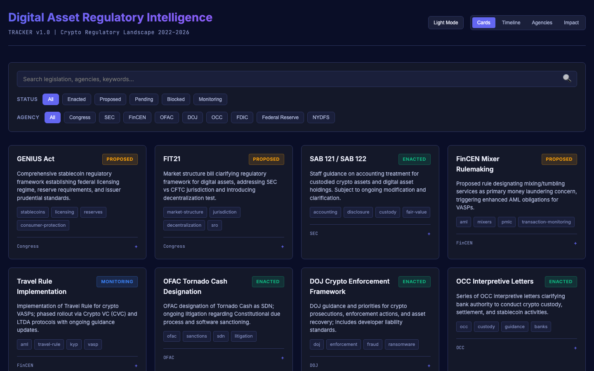

# Showcase — Companion Visual Surfaces

Static, single-file HTML surfaces that illustrate the visual half of an agent fleet's output stack. One is an interactive mockup of the fleet's **Slack workspace** itself — how agent output actually lands for the operator. The other two are **analytical dashboards** that share the fleet's domain focus — crypto AML typologies and the digital-asset regulatory landscape. None are produced by the agents directly; they are reference artifacts illustrating the kinds of surface a fleet's output layer targets.

Each dashboard is a self-contained HTML file — no build step, no backend, no dependencies. Open in a browser, serve locally, or use the live demos at **[maxmoran23.github.io/Claude-Agent-Fleet](https://maxmoran23.github.io/Claude-Agent-Fleet/)** (deployed from this directory via GitHub Pages on every push).

---

## Fleet Slack Workspace — Interactive Mockup

An operator's-eye portrait of the fleet's Slack environment: the channel
taxonomy in the sidebar (with unread markers and mute indicators), realistically-styled
agent posts assembled from the [Block Kit component library](../schemas/slack-block-kit-templates.md),
critical [alert cards](slack-workspace/), consolidated daily digests, interactive
Q&A, and the pinned [state canvases](../schemas/slack-canvas-structure.md) in the
right pane. **Interactive:** click between channels (or use <kbd>↑</kbd>/<kbd>↓</kbd>),
expand any thread to read the in-thread cross-references and operator notes, and
toggle dark/light (<kbd>t</kbd>) — to see how routing, threading, and severity
coding play out across the workspace.

- **Path:** [`slack-workspace/index.html`](slack-workspace/index.html)
- **Audience:** Anyone evaluating how agent output should *land* — fleet operators, designers, hiring reviewers
- **Use:** Visual companion to the two workspace specs in [`schemas/`](../schemas/); shows the cosmetic end-state the channel architecture and Block Kit templates produce
- **Built from:** [`schemas/slack-workspace-architecture.md`](../schemas/slack-workspace-architecture.md) + [`schemas/slack-block-kit-templates.md`](../schemas/slack-block-kit-templates.md)

## Crypto AML Typology Engine


Reference library of fifteen crypto AML typologies organized by category (sanctions evasion, money laundering, fraud, market manipulation). Each typology includes detection rules, behavioral indicators, enrichment steps, and regulatory citations.

- **Path:** [`crypto-aml-typology-engine/index.html`](crypto-aml-typology-engine/index.html)
- **Audience:** AML/compliance analysts, transaction-monitoring engineers, on-chain investigators
- **Use:** Reference during alert triage; reference for typology mapping during model validation; onboarding material for analysts new to crypto AML

## Digital Asset Regulatory Intelligence Tracker



Filterable view of the active digital-asset regulatory landscape — proposed legislation, agency rulemaking, enforcement actions, and interpretive guidance. Status tracking (active / proposed / pending / revised / withdrawn) and category filters (legislation, FINCEN, OFAC, OCC, SEC, federal reserve).

- **Path:** [`regulatory-intelligence-tracker/index.html`](regulatory-intelligence-tracker/index.html)
- **Audience:** Compliance officers, policy analysts, fintech legal teams
- **Use:** Quarterly compliance program review; horizon scanning for upcoming rule changes; regulatory impact analysis

---

## Running Locally

Any static HTTP server works. From the repository root:

```bash
python3 -m http.server 8765 --directory showcase
# Then open:
#   http://localhost:8765/slack-workspace/
#   http://localhost:8765/crypto-aml-typology-engine/
#   http://localhost:8765/regulatory-intelligence-tracker/
```

All three surfaces are dark-themed by default with a light-mode toggle. Tested in Chrome and Safari on macOS.

---

## Why These Are Here

The agents in this repository produce text intelligence — Slack posts, digest emails, briefing summaries. That is one half of an agent fleet's output surface. The other half is visual — the workspace those posts land in, and the dashboards that present the same underlying data in a form better suited to ad-hoc query and visual pattern recognition. These companion artifacts illustrate what the visual half looks like when designed with the same audit-defensible, compliance-focused discipline as the agent prompts.

The **Slack workspace mockup** is built directly from the workspace and Block Kit specs in [`schemas/`](../schemas/) — it's the cosmetic end-state those conventions produce. The **two analytical dashboards** were built independently of the fleet and predate the runnable reference agents in `agents/`; they're included as portfolio context, the same domain expertise that shaped the agent specs in `examples/` applied to standalone analytical surfaces. Together they sketch the full output stack — text intelligence from agents, the workspace it lands in, and visual surfaces for deeper analysis.
